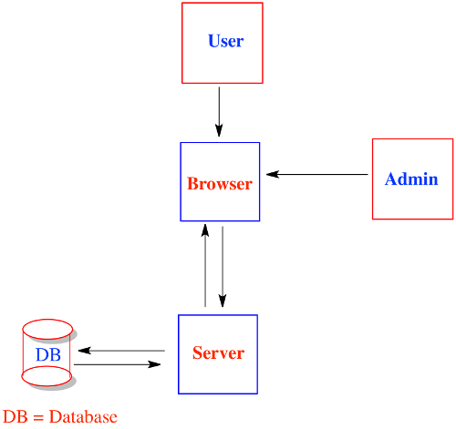

# Tshirt.ly

## Goal

With a small group, build a t-shirt inventory tracker.

## Authors:

- Peter Pine
- Dipshikha Biswas
- Evan Griffiths
- Sebastian Salinas
- Kwasi James

## Technologies required:

- Sinatra
- Active Record
- sqlite3

### Features

## Part 1: Show the T-Shirts

- A user can see a list of t-shirts and quantity available for each shirt.

## Part 2: Buying a T-Shirt

- The user can "buy" any quantity of a single t-shirt style at a time, assuming the store has at least that quantity in inventory.
- The user does not enter payment information.
- The user selects the quantity they want to purchase, and enters an email address.
- The quantity on the page should change to reflect the new amount of shirts availabe for purchase.
- The user is presented with a confirmation page.

## Part 3: Admin Area

- The admin user can go to /admin and see an admin panel. (Usually an admin panel would require a special login, but for now just let anyone go to this route).
- The admin user can add t-shirts, remove t-shirts and update t-shirts. Each t-shirt for sale has a quantity avaiable, a price, and an image url. (all t-shirts are one-size-fits-all)
- The admin user can also see a list of all past purchases created by their customers.

